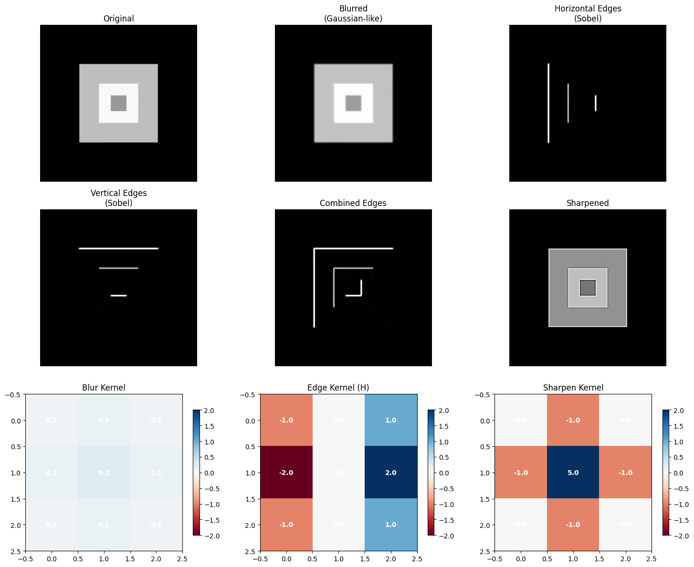
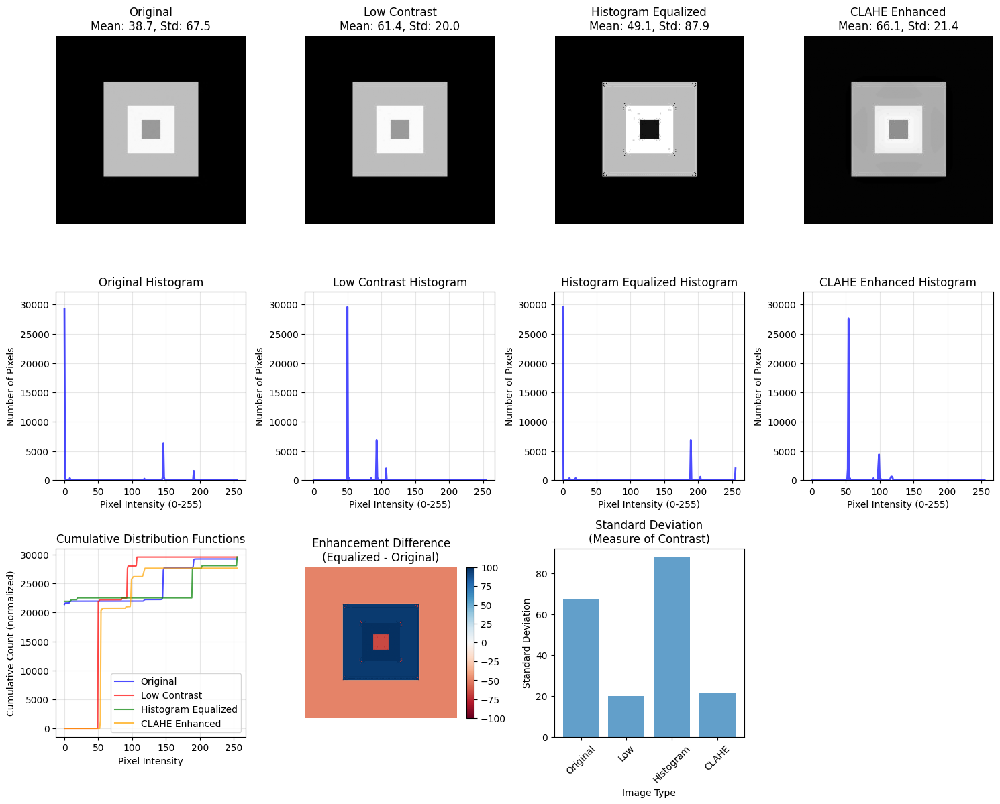

# Image Processing: From Pixels to Perception

## Problem Statement

How can basic mathematical operations transform an image and prepare it for later computer vision or machine learning tasks?

## Approach

The notebook treats images as NumPy arrays and explores RGB channels, grayscale conversion, brightness and contrast changes, neighborhood filtering, custom convolution kernels, histogram analysis and enhancement, geometric transforms, and combinations of multiple operations.

## Results

All 12 code cells were executed successfully, and the notebook retains its plots and processed-image outputs. The experiments show how channel operations alter color, kernels blur or emphasize edges, histogram techniques change contrast, and geometric operations change spatial layout.

Selected notebook outputs are also saved separately for quick review:

## Key Findings

- Images are height × width × channel matrices rather than continuous objects.
- Point operations change pixels independently, while filters use local neighborhoods.
- Classical preprocessing remains useful before and after learned AI models.
- Combining channel separation with filtering produced especially noticeable visual changes.

## Technologies Used

Python, OpenCV, NumPy, Pillow, Matplotlib, Requests, and Google Colab.

## Data

The saved run uses a programmatically generated test pattern, so no external dataset is required. When network access is available, the notebook can also download the public [Vd-Orig sample image from Wikimedia Commons](https://commons.wikimedia.org/wiki/File:Vd-Orig.png). No large dataset is stored in this repository.

## Files

- [Image-Processing-From-Pixels-to-Perception.ipynb](Image-Processing-From-Pixels-to-Perception.ipynb)
- [Image-Processing-Reflection.pdf](Image-Processing-Reflection.pdf)
- [Saved result images](results/)

## How to Run

Open the notebook in Google Colab and select **Runtime → Run all**. The first cell installs the required image-processing packages.
