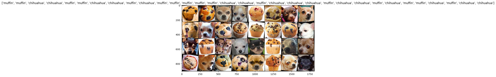
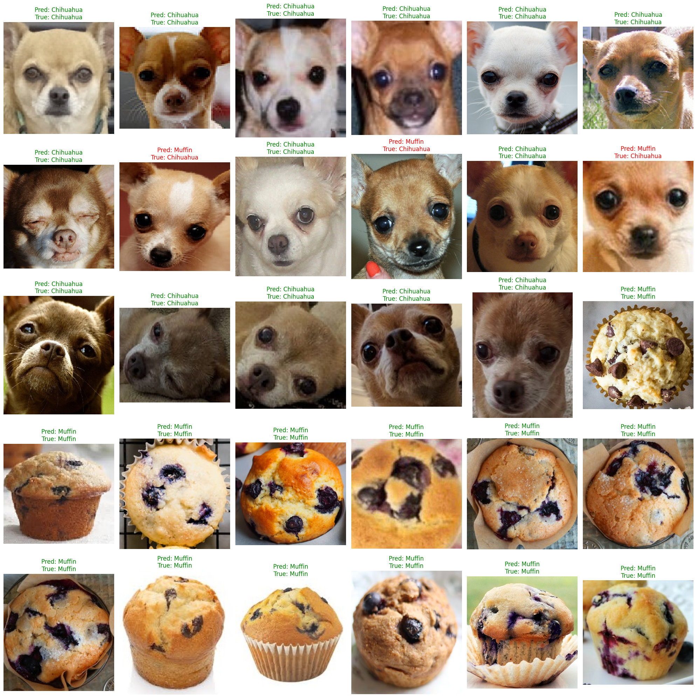

# CNN Image Classifier: Chihuahua vs. Muffin

## Problem Statement

This project improves the earlier dense-network baseline by using a convolutional neural network that preserves spatial relationships in the images.

## Approach

The PyTorch model uses 3 × 3 convolutional filters, ReLU activation, max pooling, and fully connected output layers. Images are resized, normalized, loaded in batches, and evaluated after each of ten training epochs.

## Results

- Final validation accuracy: **90.0%**
- Peak validation accuracy: **100.0% at epoch 7**
- Validation accuracy at epoch 9: 96.7%
- Validation loss at epoch 10: 0.1697

The validation set contains only 30 images, so the peak is not presented as evidence of production performance. The movement between 100%, 86.7%, 96.7%, and 90.0% also shows why small validation sets can produce unstable metrics.

## Key Findings

- Convolution and pooling preserve local structure and learn visual features more effectively than a flattened dense network.
- The CNN substantially improved the final validation result over the prior baseline.
- Data augmentation, transfer learning, and a larger dataset would be the next steps for a more reliable classifier.
- Classification errors and confidence should be reviewed before using vision models in high-stakes settings.

## Technologies Used

Python, PyTorch, Torchvision, NumPy, Matplotlib, TorchSummary, and Google Colab.

## Data

The tutorial dataset contains 120 training images and 30 validation images. It is downloaded at runtime from the public [`patitimoner/workshop-chihuahua-vs-muffin`](https://github.com/patitimoner/workshop-chihuahua-vs-muffin) repository and is not duplicated here.

## Files

- [CNN-Chihuahua-vs-Muffin.ipynb](CNN-Chihuahua-vs-Muffin.ipynb)
- [CNN-Classifier-Reflection.pdf](CNN-Classifier-Reflection.pdf)
- [Saved result images](results/)

## How to Run

Open the notebook in Google Colab, enable a GPU if available, and run all cells. The notebook downloads the data and installs or upgrades its PyTorch dependencies.
