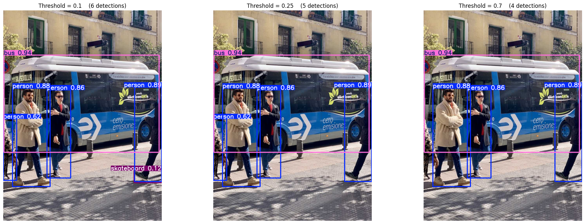
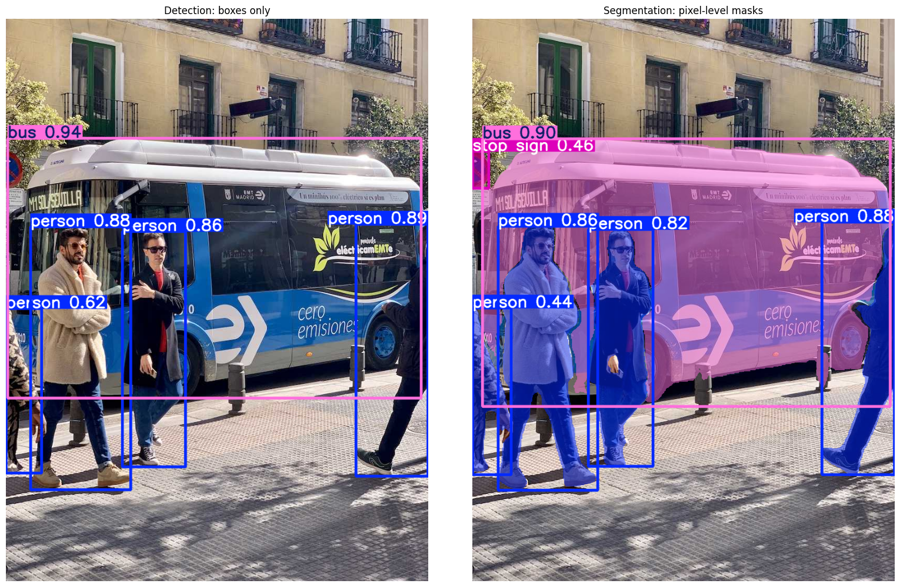
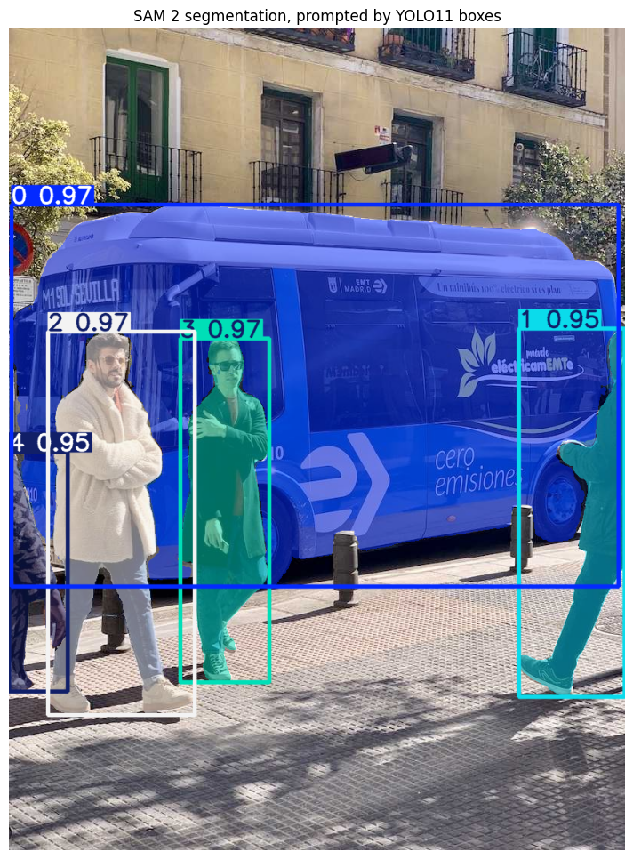

# Object Detection and Image Segmentation

## Problem Statement

This lab compares three levels of computer vision understanding: assigning one label to an image, drawing boxes around individual objects, and producing pixel-level masks for those objects.

## Approach

The notebook uses YOLO11 for object detection, YOLO11-seg for instance segmentation, and SAM 2 for promptable segmentation. It explores confidence thresholds, Non-Maximum Suppression, IoU, precision, recall, and mAP, then connects those trade-offs to safety and security applications. Bonus exercises include open-vocabulary detection and a five-epoch YOLO11n learning run on COCO8.

## Results

- YOLO11 detected five objects in the primary sample image: one bus and four people.
- YOLO11-seg returned six object masks for the segmentation example.
- The COCO8 learning exercise completed five epochs and reported:
  - Precision: 0.627
  - Recall: 0.850
  - mAP50: **0.844**
  - mAP50–95: **0.659**
  - Inference: approximately 203 ms per image on the recorded CPU run

COCO8 contains only eight images and is intended to verify a training pipeline, not to establish a production benchmark.

## Key Findings

- Bounding boxes are sufficient for many counting and tracking tasks, while masks are needed when shape boundaries matter.
- Lower confidence thresholds favor recall; higher thresholds favor precision.
- YOLO is a fast specialist with category labels, while SAM 2 is a flexible promptable segmenter without category labels.
- Safety systems usually prioritize recall because missed hazards can be more costly than false alarms.

## Technologies Used

Python, Ultralytics, YOLO11, YOLO11-seg, YOLO-World, SAM 2, PyTorch, Pillow, NumPy, Matplotlib, and Google Colab.

## Data and Models

The notebook downloads the public [Ultralytics bus sample image](https://ultralytics.com/images/bus.jpg), [COCO8 learning dataset](https://docs.ultralytics.com/datasets/detect/coco8/), and pretrained [YOLO11 models](https://docs.ultralytics.com/models/yolo11/) during execution. COCO8 has four training and four validation images and is intended for pipeline checks. The external data and model weights are not stored in this repository.

## Files

- [YOLO11-SAM2-Detection-Segmentation.ipynb](YOLO11-SAM2-Detection-Segmentation.ipynb)
- [Saved result images](results/)

## How to Run

Open the notebook in Google Colab and run the core sections in order. Internet access is required for package, model-weight, and sample-image downloads. The optional training and open-vocabulary sections take longer than the core lab.
